<a href="https://realkazbek.site">website</a> · <a href="https://github.com/RealKazbek">github</a> · <a href="https://t.me/RealKazbek">telegram</a>

### <code>kazbek@github:~$ cat current-focus.txt</code>

I’m a backend-focused full-stack developer from Almaty, building reliable services with **Go**, PostgreSQL, REST APIs, Docker, Git, and Linux. I also work across Python backends and modern web interfaces when the product needs the whole system.

### <code>kazbek@github:~$ cat stack.txt</code>

| Area | Working with |
| :-- | :-- |
| **Backend** | Go · Python · FastAPI · Django REST Framework · PostgreSQL · REST APIs |
| **Frontend** | React · Next.js · TypeScript · Tailwind CSS |
| **Delivery** | Docker · Docker Compose · Nginx · GitHub Actions · Linux · Git |
| **Systems** | ESP32 · Computer Vision · Smart City concepts |

### <code>kazbek@github:~$ cat current-project.txt</code>

## Pixel Lane

An evolving intelligent traffic-management system: a camera feeds computer vision for vehicle detection and counting; intersection load informs adaptive traffic-light control; an ESP32 drives the physical light. The goal is a clear real-time view of intersection state, vehicle statistics, traffic load, and signal state.

<code>camera → computer vision → vehicle signals → load estimate → adaptive control → ESP32 light</code>

### <code>kazbek@github:~$ git log --oneline --selected</code>

- [TerraCon](https://github.com/RealKazbek/TerraCon) — a full-stack platform monorepo with Next.js, Django, PostgreSQL/SQLite, Docker Compose, and Nginx.
- [mg-market](https://github.com/RealKazbek/mg-market) — a Telegram commerce demo spanning a FastAPI backend, bot, mini app, admin dashboard, and payments.
- [Kazbek Assistant](https://github.com/RealKazbek/assistant) — a Telegram Business assistant with persistent SQLite memory, retrieval, and owner-controlled automation.

### <code>kazbek@github:~$ ./activity</code>

### <code>kazbek@github:~$ echo $CONTACT</code>

Open to thoughtful conversations about backend engineering, Go, computer vision, embedded systems, and building useful city-scale tools. Find me on [Telegram](https://t.me/RealKazbek) or at [realkazbek.site](https://realkazbek.site).
