  

  

  

  

  <code>kazbek@github:~$ cat projects/pixel-lane</code> 
  camera → computer vision → vehicle load → adaptive signals → ESP32

  <a href="https://github.com/RealKazbek/TerraCon">TerraCon</a> ·
  <a href="https://github.com/RealKazbek/mg-market">mg-market</a> ·
  <a href="https://github.com/RealKazbek/assistant">Kazbek Assistant</a> ·
  <a href="https://realkazbek.site">realkazbek.site</a> ·
  <a href="https://t.me/RealKazbek">Telegram</a>

